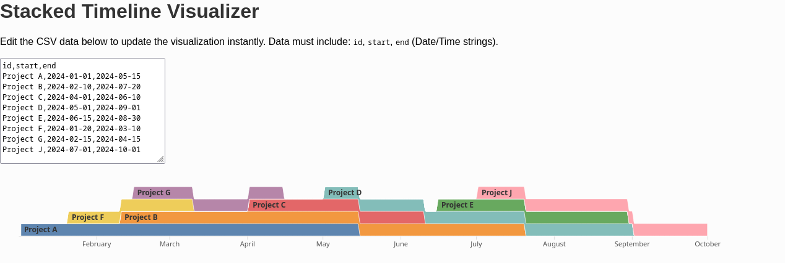

# Stacked Timeline Visualizer

A simple visualization tool that runs on GitHub Pages. It converts CSV files containing time periods (start/end) and IDs into a dynamic "stacked bump chart" (similar to a streamgraph).

This project was created to dynamically stack overlapping time periods and display their "presence" on a timeline.

## Demo

A live demo of this page is hosted on GitHub Pages:

**[https://zapzarapza.github.io/](https://zapzarapza.github.io/)**


### Screenshot

Here is a screenshot of what the visualization looks like with sample data:



---

## Usage

1.  Visit the [live demo page](#) (see link above).
2.  Make sure your CSV file has the correct format (see below).
3.  Click "Select File" and upload your `.csv` file.
4.  The visualization will be generated automatically on the page.

---

## Required data format

For the visualization to work, the CSV file must have exactly the following column headers in the first row:

`id,start,end`

### Column explanation

* `id`: A unique name or ID for the time series (e.g., `Candidate A`, `Project B`).
* `start`: The start time.
* `end`: The end time (after start).

### Example CSV (`testdata.csv`)

```csv
id,start,end
Project A,2024-01-01,2024-05-15
Project B,2024-02-10,2024-07-20
Project C,2024-04-01,2024-06-10
Project D,2024-05-01,2024-09-01
Project E,2024-06-15,2024-08-30
Project F,2024-01-20,2024-03-10
Project G,2024-02-15,2024-04-15
Project H,2024-07-01,2024-10-01
```